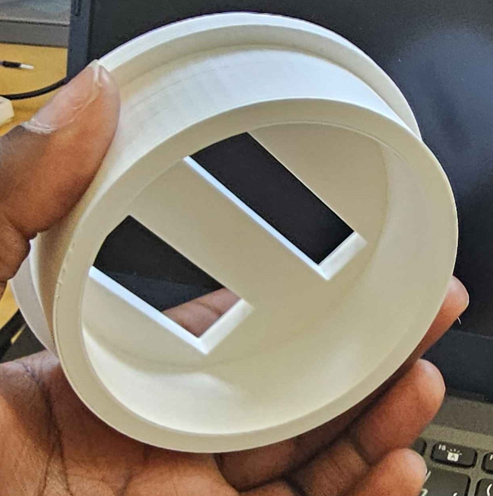
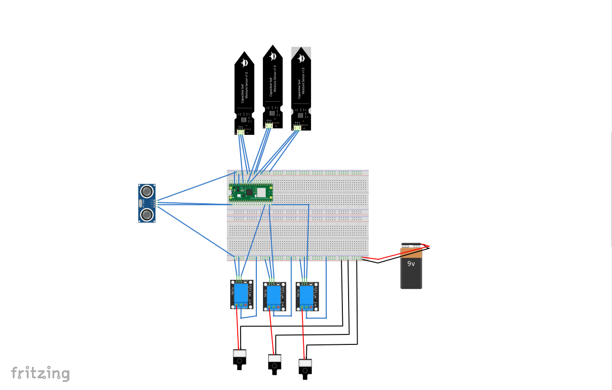
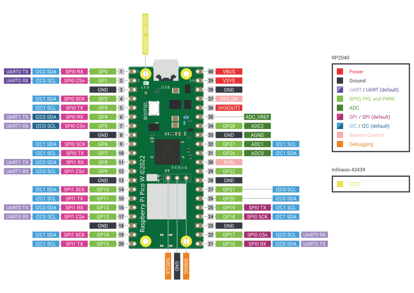
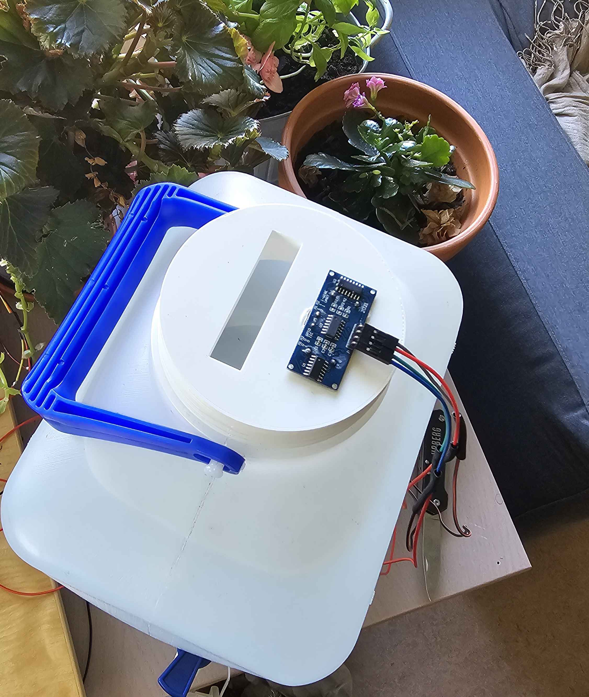
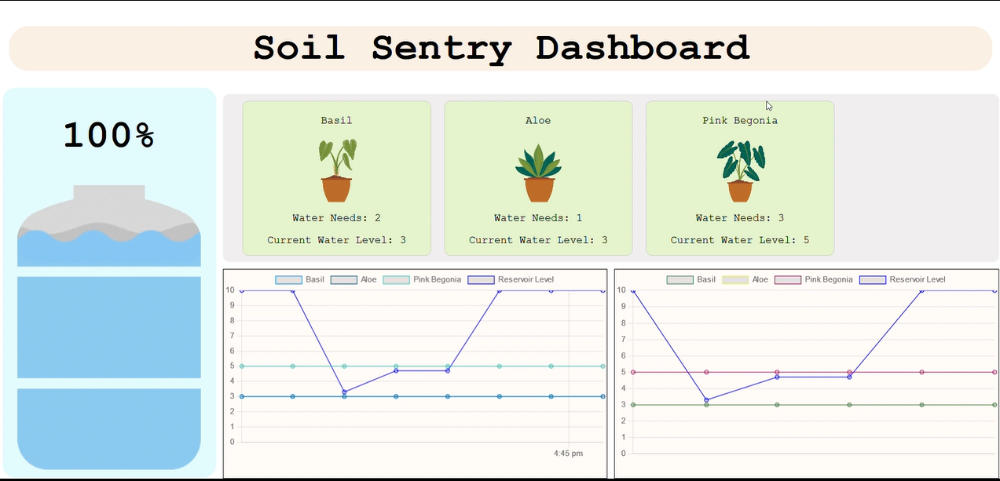
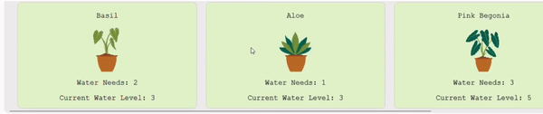
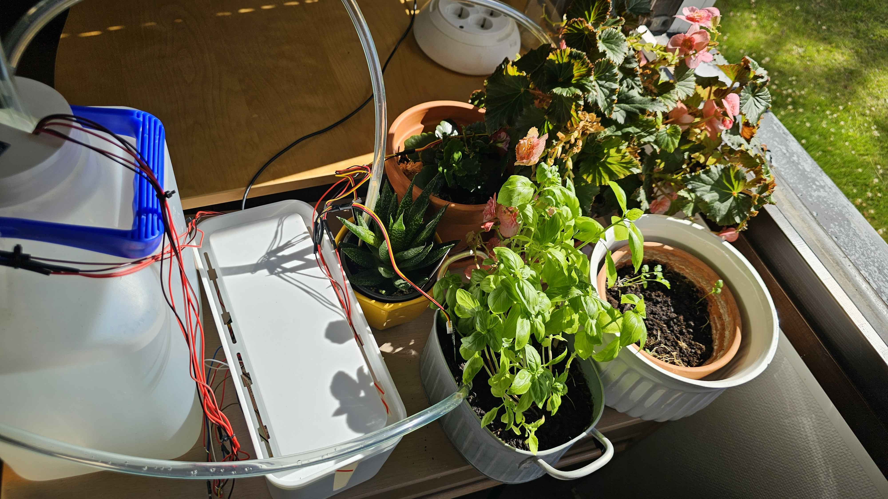

## Table of contents
- [Author](#author)
- [Project Overview](#project-overview)
- [Estimated Time](#estimated-time)
- [Project Objective](#project-objective)
- [Bill of Materials](#bill-of-materials)
- [Computer Setup](#computer-setup)
  - [IDE](#ide)
  - [Raspberry Pi Pico W Setup](#raspberry-pi-pico-w-setup)
  - [Wiring](#wiring)
- [Platform for Data Transmission](#platform-for-data-transmission)
- [The Code](#the-code)
  - [Controller Code](#controller-code)
  - [Server Code](#server-code)
- [Final Look](#final-look)

## Author
By Alambuya Chelsea CA223SF

## Project Overview
The soil sentry is a small scale irrigation system which allows a user to connect multiple plants with various water consumption needs, monitor their water levels and supply water them when needed in addition to monitoring the water reservoir levels. 

## Estimated Time
- Setting up the whole project with the IDE and getting everything connected takes about 5 hours with 2 hours of active setup and about 3 hours for designing a 3D printing the reservoir mount where ultrasonic sensor will rest. The container I chose for the reservoir was relatively small so this the printing did not take much time, see the picture below

## Project Objective
Many at home watering solutins exist but are limited to just soil moisture levels and water supply. These solutions are sufficient for plants that have the same water consumption needs but to an owner of various plant types like succulents, herbs and flowering plants this can lead to over or under watering plants by trying to calibrate a single water supply to them.
With the soil sentry, a user can create differnt plant profiles where each plant's water consumption needs will determine how offen it recieves water from the supply. Additionally, the water reservoir is monitored which allows the user to know when re-fill it.
By monitoring the data, users can have a better idea of their plant needs, reduce water waste by ensuring the plants are only watered when they need it.

## Bill of Materials
These items can be purchased online at stores that sells electronic components, single board computers, modules, sensors etc. Reliable options are [The pi hut](thepihut.com), [electrokit](electrokit.com), [amazon.se](amazon.se) and any non electronic components can be found at a hardware store.
|Image|Component|Price (SEK)|Purpose|
|---|---|---|-----|
| |Raspberry Pi Pico W| 89| Reads the sensor data and transmits it to the server|
| |Capacitive Soil Moisture Sensor V2.0 *| 44| To measure the soil moisture level |
| |Submersible waterpump 3V *| 45| To pump the water from the reservoir to the plants|
||5V Relay Module *| 60|Handles switching operations between the 3V pump and a separate 5V control signal|
||9V Battery|60|Power Supply for the water  pumps|
||Breadboard Power Supply Module|60|Power Supply to the breadboard for the water  pumps|
||HC-SR04 Ultrasonic Range Sensor| 23| To measure the reservoir level|
||Male-Male Jumper Wires| 100| To connect components to the Pico|
||Female-Male Jumper Wires| 100| To connect components to the Pico|
||Female-Female Jumper Wires| 100| To connect components to the Pico|
||Silicon Water Pipe| 45| To transport water to the plant|
||2 Core Electric Cable| 121| To extend the length of jumper wires|
||Soldering Iron Kit| 500| To join 2 wires|
||Solder Wire| 100| To join 2 wires|
||Desoldering Wick| 100| To erase the makes you made (with the soldering, not in real life)|
||Electric Tape| 60| To seal soldered wires that will be placed in water|
||Heat Shrink| 90| To seal soldered wires that will be placed in water|

  * Get one per plant you intend to monitor

## Computer Setup
### IDE
I developed this on a computer running windows 11. I decided to use Thonny for the microcontroller code because it is specifically designed for beginners in MicroPython programming, offering an intuitive interface, easy debugging tools for microcontroller projects. Installation instruction can be found on the [Thonny website](https://thonny.org/). For the server side code I used VS Code

### Raspberry Pi Pico W setup
To set up the pico first download the latest version of Raspberry Pi Pico W firmware [here](https://rpf.io/pico-w-firmware), once downloaded connect the pico to your computer while holding down the bootsel button. A file manager should open with the raspberry pi pico w as the connected device, copy the firmware file to the device and the file manager will close. Open the Thonny editor and on the navigation bar, select Tools > Options > Interpreter and choose the MicroPython interpreter for Raspberry Pi Pico.

### Wiring

- Breadboard - I connected 2 boards to reduce crowding but it's possible to have everything on one.

- Raspberry Pi Pico W - place the Pico over the center of the breadboard with the pins straddling the center divide. Connect the pico's GND to the (-) line on the right side of the breadboard and the 3V3 output to the (+) line on the on the right side of the breadboard. See the attached pico w pinout for guidance. 

- 9V Battery - Connect the battery's (-) to the (-) and the (+) to the (+) lines on the left side of the breadboard.

- Soil moisture sensors - For my set up, I used analog sensors so I was limited to 3 analog to digital converter (ADC) pins on the pico i.e. GP26, GP27 and GP28. This will be placed in the soil to measure the moisture content. Connect the sensor's vcc to the (+) line on the bread board, the GND to the (-) line on the breadboard and the analog output to one of the ADC pins. Since soil sensors are different you may have to calibrate them according to your environment. Follow these steps to calibrate them;

  - Take readings in open air, very dry soil, dry soil, lightly watered soil, heavily watered soil and 100% water. 
  - Take about 100 readings for each  and find the highest and lowest values
  - Create a scale of 0 - 5 where 0 is open air and 5 is 100% water.

- Ultra sonic sensor - This should rest on top of the water reservoir. For this project, I designed a 3D mount to set on top of the reservoir. Connect the sensor's GND to any (-)line on the breadboard and the vcc to any (+) line on the breadboard. Connect the trig pin to GPIO 0 and connect the echo pin to GPIO 1.

Calibrating the ultra sonic sensor is similar to the soil moisture sensors;
  - Set up the sensor above the reservoir and take readings when the reservoir is empty, and slowly increase the water level taking several readings as you go.
  - Create a percentage scale after getting the reading at multiple levels.

- Water Pump and 5V relay module - Connect the water pump's gnd to the left side (-) line on the breadboard and the the pump's (+) line to the relays normally open(NO) terminal. Then connect the relay's (-) and (+) pins to the GND and the (+) line on the left side of the breadboard. Connect the relays control input pin to any available GPIO pin.

### Platform for Data Transimission
For the project, I decided to send the sensor data via a json data file sent over HTTP. I set up a server on my laptop to listen for data transmitted by the pico inorder to process it. When the pico connects to the same network as the server, the sensor data is read and transmitted to the server as a POST request and stored as a variable. When the dashboard is requested for from a browser, the server servers the index.html file (styled with css) and JavaScript method requests for the data to be displayed. At this point, the data has been recieved by the server and stored in a variable so this information is sent. I decided to create a custom dashboard as I felt the available options were too restricting in how the data could be visualized and additionally I could style it to my preference.

### The Code
#### Controller Code
The code is fairly straight forward. In controller_code folder is the code to be uploaded to the Raspberry Pi Pico W and works as follows,
  - plant_profile.py: This class allows different plant types to be created with specific water needs, a soil sensor pin and a water pump pin.
  - water_pump.py: This allows the water to be turned on and off when a plant requires water
  - Soil_sensor.py: This takes the soil moisture level and converts it according to the scale created during the sensor calibration
  - ultrasonic_sensor.py: This transimits a sonic pulse, waits for an encho and uses the time difference to determine how far the water is from the sensor, this is then converted to an approximate percentage of remaining water in the reservoir.
  - main.py: This is where different plant profiles are created with their respective soil sensors and water pump pins. The ultra sonic sensor is also initialized with the trigger and echo pins. The program then periodically reads data from the various sensors and transmits it to the server via an HTTP POST request. After the data is transmitted, the reservoir level is checked to make sure there's enough enough water to water  the plants, if there is, all the plants' current water levels are checked to see if they fall below their water needs. If the water level is below their needs, then it's associated pump is turned on for 10 seconds which provides sufficient water to increase it's current water level and then turned off. After one hour, the process is repeated.

#### Server code
This Python script sets up a system to manage sensor data through both an HTTP server and a WebSocket server. The HTTP server, built using `BaseHTTPRequestHandler` and `HTTPServer`, handles GET requests to serve static files like `index.html`, `styles.css`, and `script.js`, as well as JSON data for endpoints such as `/plants` and `/ultrasonic_reading`. It also handles POST requests to receive sensor data at the `/receive_data` endpoint, storing this data in a global dictionary `sensor_data`. When new sensor data is posted, it is also sent to all connected WebSocket clients using asynchronous communication.

The WebSocket server, created with the `websockets` library, manages real-time communication with clients. It handles incoming WebSocket connections and responds to requests for sensor data. A function `send_data_to_clients` is used to broadcast updated sensor data to all connected WebSocket clients. Both servers are run concurrently: the HTTP server in a separate thread and the WebSocket server in the main thread, allowing the system to handle HTTP requests and WebSocket communication simultaneously. This setup facilitates a dashboard webpage where clients can receive dynamic updates of sensor data in real-time.

## Final look
Over all, the roject turned out as I origianlly designed but throught out the process I realized I was limited to only 3 three ADC pins on the pico so if i wanted to add more plants I'd have to purchase an additional digital soils sensor. It was also quite difficult to calibrate the soil sensors as they were quite immprecise and had verry different ranges.

The final dashboard

Plant window with multiple plants

Final Setup shot 1

Final setup shot 2

## Youtube Video 
Check out [this](https://youtu.be/vv5wq6jMT6I) youtube video to see the dashboard in action.